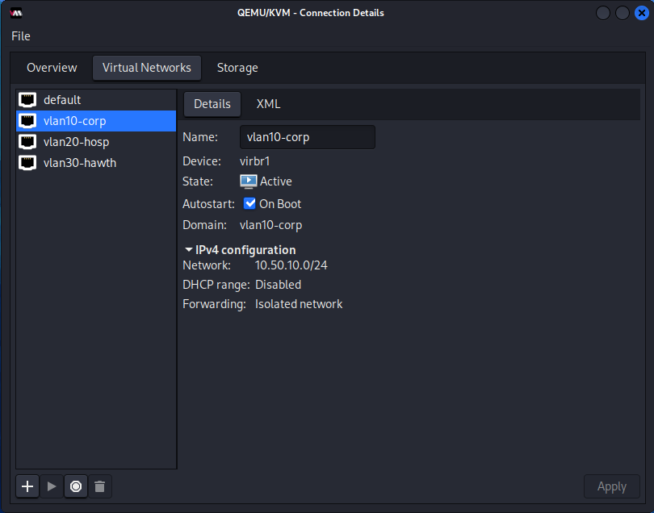
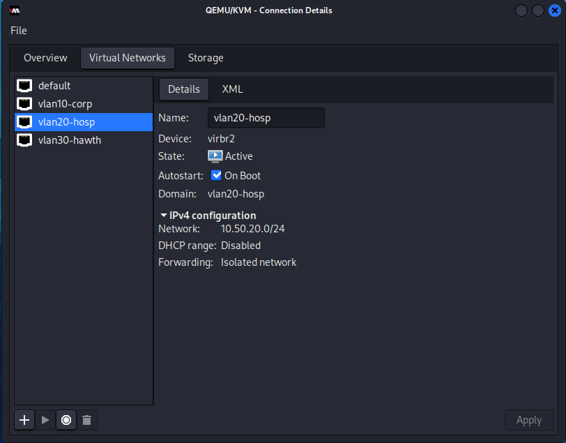
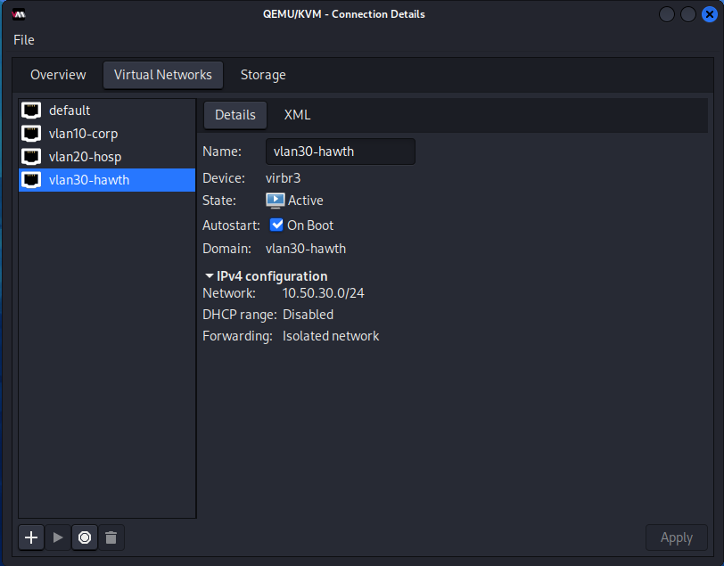
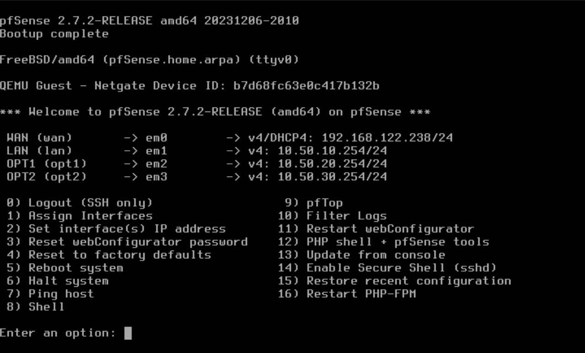
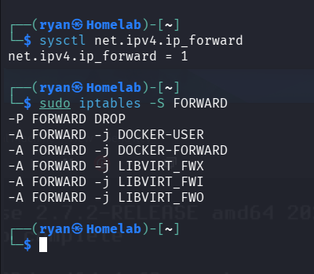
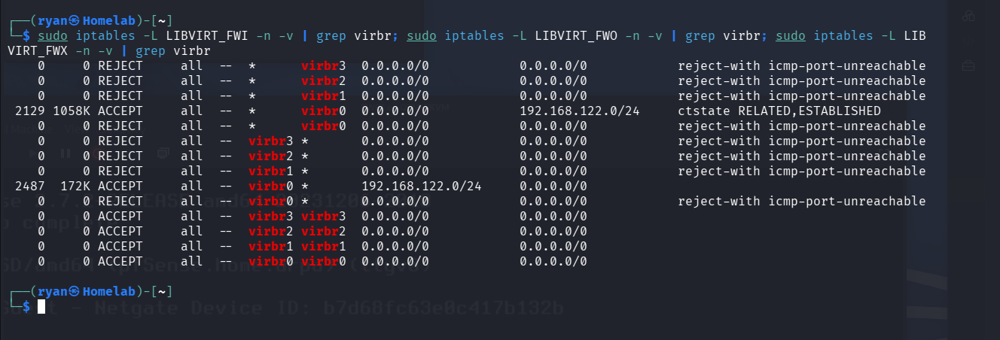

# IHA-RB-NET-Foundation
**Category:** Network (NET)
**Subject:** Virtual network foundation — VLAN segmentation and FW01 (pfSense) setup
**Last updated:** July 6, 2026

## Purpose
Documents how Ironbridge Health Alliance's Phase 1 network segmentation is implemented in KVM/QEMU, and how FW01 (pfSense) is configured as the sole routing and policy boundary between segments.

## Prerequisites
- KVM/QEMU with Virtual Machine Manager
- pfSense CE ISO (this build used 2.7.2-RELEASE, amd64)

## Virtual network configuration
Three isolated libvirt networks represent the three VLAN segments. None use NAT or DHCP — FW01 is the only router and DHCP source between them.

| Network name | Subnet | Mode | DHCP |
|---|---|---|---|
| vlan10-corp | 10.50.10.0/24 | Isolated | Disabled |
| vlan20-hosp | 10.50.20.0/24 | Isolated | Disabled |
| vlan30-hawth | 10.50.30.0/24 | Isolated | Disabled |

The existing `default` NAT network (192.168.122.0/24) is retained as FW01's WAN leg only — no other VM attaches to it.

**Configured networks:**





**Steps to create each isolated network** (Virtual Machine Manager → Connection Details → Virtual Networks → +):
1. Set Name, Mode = Isolated
2. Enable IPv4, enter the subnet
3. Leave "Enable DHCPv4" unchecked
4. Leave IPv6 disabled
5. Finish, then confirm Autostart is checked so it survives host reboot

## FW01 (pfSense) build
- 1 vCPU, 1024 MB RAM, 8–20 GB disk
- OS variant: **Generic** (pfSense is FreeBSD-based, not Linux — avoid the "Generic Linux" variant, which applies Linux-specific assumptions)
- Partitioning: **UFS**, not ZFS — ZFS's ARC cache overhead isn't worth it on a 1GB-RAM firewall
- Attach four NICs before first boot, one per network: `default`, `vlan10-corp`, `vlan20-hosp`, `vlan30-hawth`

## Interface assignment (console)
From the pfSense console menu, option **1) Assign Interfaces**:
- Decline VLAN setup (segmentation is handled by separate isolated libvirt networks, not 802.1Q tagging)
- Map interfaces in order: WAN → em0 (default/WAN leg), LAN → em1 (vlan10-corp), OPT1 → em2 (vlan20-hosp), OPT2 → em3 (vlan30-hawth)

**Confirmed result after IP addressing (see next section):**



## IP addressing — and a gotcha worth knowing
Option **2) Set interface(s) IP address** from the console:
- LAN: **10.50.10.254**/24
- OPT1: **10.50.20.254**/24
- OPT2: **10.50.30.254**/24
- WAN: left on DHCP from the `default` network

**Gotcha:** libvirt assigns the `.1` address on each isolated network to its own bridge interface (e.g., `virbr1` for vlan10-corp) even when DHCP is disabled on that network. Setting FW01's corresponding interface to `.1` creates a duplicate-IP conflict with the host itself. Confirm the host's bridge address first with `ip addr show virbr1` (or virbr2/virbr3) before assigning FW01's interface IPs, and use a different host suffix (this build uses `.254`) for firewall interfaces. Every downstream VM's default gateway on each VLAN should point to the `.254` address, not `.1`.

## Security decisions
- webConfigurator remains on **HTTPS** — the self-signed certificate warning on first GUI access is expected and should be accepted, not bypassed by reverting to HTTP.

## Verification
- `ip addr show virbr1` / `virbr2` / `virbr3` on the KVM host should show no conflicting address with FW01's assigned interface IPs
- pfSense console (option 1 menu) should list all four interfaces with correct IP assignments

**Host-level cross-VLAN forwarding (related to risk register entry IHA-006):**

Because the KVM host itself sits on all three VLAN bridges (virbr1/2/3) in addition to WAN (virbr0), and kernel IP forwarding is enabled to support the WAN NAT, it's worth explicitly verifying the host cannot route traffic between VLANs on its own — which would bypass FW01 as the intended sole inter-segment path.

Check the FORWARD chain and libvirt's sub-chains:
```
sysctl net.ipv4.ip_forward
sudo iptables -S FORWARD
sudo iptables -L LIBVIRT_FWI -n -v | grep virbr
sudo iptables -L LIBVIRT_FWO -n -v | grep virbr
sudo iptables -L LIBVIRT_FWX -n -v | grep virbr
```




Expected result: `LIBVIRT_FWI`/`LIBVIRT_FWO` show explicit REJECT-all rules for each VLAN bridge, and the only ACCEPT rules in `LIBVIRT_FWX` are same-bridge-to-same-bridge (intra-VLAN traffic only, not cross-VLAN). This confirms libvirt's default isolated-network rules already block host-level routing between segments — see IHA-006 for the full write-up.
